# Codebase Structure Diagram

Here is a diagram representing the module structure, visibility, and key components of the **mokapot** codebase.

## Module Hierarchy & Relationship Diagram

```mermaid
graph TD
    %% Define Styles
    classDef public fill:#1a5fb4,stroke:#3584e4,stroke-width:2px,color:#ffffff;
    classDef private fill:#3d3846,stroke:#5e5c64,stroke-width:1px,color:#eeeeec;
    classDef config fill:#c061cb,stroke:#9141ac,stroke-width:1px,color:#ffffff;
    classDef test fill:#2ec27e,stroke:#26a269,stroke-width:1px,color:#ffffff;

    %% Nodes
    Root["mokapot (Crate Root)"]:::public
    CargoToml["Cargo.toml"]:::config
    
    %% Root Modules
    Lib["lib.rs (Library Root)"]:::public
    Main["main.rs (Binary Entry)"]:::public
    
    %% Lib Submodules
    GeoTools["geotools (crate-private)"]:::private
    IterTools["itertools (crate-private)"]:::private
    Testing["testing (pub)"]:::public
    Prelude["prelude (pub)"]:::public
    Models["models (pub)"]:::public

    %% Models Submodules
    Cnf["cnf (pub)"]:::public
    Doc["document (pub)"]:::public
    Index["index (crate-private)"]:::private
    Percolator["percolator (pub)"]:::public
    PercCore["percolator_core (pub)"]:::public
    Queries["queries (crate-private)"]:::private
    Types["types (crate-private)"]:::private

    %% CNF Submodules
    CnfLiteral["cnf::literal"]:::public
    CnfParsing["cnf::parsing"]:::public

    %% Percolator Core Submodules
    PercCoreTools["percolator_core::tools"]:::private
    PercCoreExtTest["percolator_core::test_extensive"]:::private

    %% Queries Submodules
    QCommon["queries::common"]:::private
    QH3["queries::h3_inside"]:::private
    QLatLng["queries::latlng_within"]:::private
    QOrdered["queries::ordered"]:::private
    QPrefix["queries::prefix"]:::private
    QTerm["queries::term"]:::private

    %% Connections
    Root --> CargoToml
    Root --> Lib
    Root --> Main

    Lib --> GeoTools
    Lib --> IterTools
    Lib --> Testing
    Lib --> Prelude
    Lib --> Models

    Models --> Cnf
    Models --> Doc
    Models --> Index
    Models --> Percolator
    Models --> PercCore
    Models --> Queries
    Models --> Types

    Cnf --> CnfLiteral
    Cnf --> CnfParsing

    PercCore --> PercCoreTools
    PercCore --> PercCoreExtTest

    Queries --> QCommon
    Queries --> QH3
    Queries --> QLatLng
    Queries --> QOrdered
    Queries --> QPrefix
    Queries --> QTerm

    %% Re-exports and Key Flows
    Prelude -.->|Re-exports| GeoTools
    Prelude -.->|Re-exports| Cnf
    Prelude -.->|Re-exports| Doc
    Prelude -.->|Re-exports| Percolator
    Prelude -.->|Re-exports| PercCore
```

---

## File & Directory Mapping

Here is the functional breakdown of each component within the codebase:

### 1. Crate Configuration & Entrance
* [Cargo.toml](Cargo.toml) — Package metadata and dependencies.
* [src/lib.rs](src/lib.rs) — Entry point for the library, defining top-level module visibility.
* [src/main.rs](src/main.rs) — Simple binary entry point, executes a basic test printout.
* [src/prelude.rs](src/prelude.rs) — Exposes commonly used structs, queries, and traits for consumer convenience.

### 2. Models & Core Logic ([src/models.rs](src/models.rs))
* **Percolation Engine**:
  * [src/models/percolator.rs](src/models/percolator.rs) — The main orchestrator for registering queries and percolating documents.
  * [src/models/percolator_core.rs](src/models/percolator_core.rs) — Low-level percolation logic and execution paths.
    * [src/models/percolator_core/tools.rs](src/models/percolator_core/tools.rs) — Core internal helper utilities.
    * [src/models/percolator_core/test_extensive.rs](src/models/percolator_core/test_extensive.rs) — Target test suite for engine validation.
* **Document Model**:
  * [src/models/document.rs](src/models/document.rs) — Data models representing fields and values in the documents to be matched.
* **Query Representation & Parsing**:
  * [src/models/cnf.rs](src/models/cnf.rs) — Conjunctive Normal Form (CNF) query definitions.
    * [src/models/cnf/literal.rs](src/models/cnf/literal.rs) — Atomic query logic and matching rules.
    * [src/models/cnf/parsing.rs](src/models/cnf/parsing.rs) — Logic to parse queries into CNF representation.
  * [src/models/queries.rs](src/models/queries.rs) — Collection of specific search operations.
    * [src/models/queries/common.rs](src/models/queries/common.rs) — General shared query utilities.
    * [src/models/queries/term.rs](src/models/queries/term.rs) — Exact term-matching queries.
    * [src/models/queries/prefix.rs](src/models/queries/prefix.rs) — Prefix-matching queries.
    * [src/models/queries/ordered.rs](src/models/queries/ordered.rs) — Position-aware or ordered query segments.
    * [src/models/queries/h3_inside.rs](src/models/queries/h3_inside.rs) — Geospatial query checking if coords are in an H3 index region.
    * [src/models/queries/latlng_within.rs](src/models/queries/latlng_within.rs) — Geographic distance/bounding box constraint queries.
* **Indexing & Internal Types**:
  * [src/models/index.rs](src/models/index.rs) — In-memory index layout for resolving queries matching documents.
  * [src/models/types.rs](src/models/types.rs) — Shared system primitive type definitions.

### 3. Utility Modules
* [src/geotools.rs](src/geotools.rs) — Calculations and types relating to distance and coordinate systems.
* [src/itertools.rs](src/itertools.rs) — Convenience functions for working with custom iterators.
* [src/testing.rs](src/testing.rs) — Helpers and mock generators for testing.

### 4. Integration Tests & Benchmarks
* **Benchmarks** (`benches/`):
  * [benches/percolate_real.rs](benches/percolate_real.rs) — Performance benchmark using real-world percolation scenarios.
  * [benches/queries.rs](benches/queries.rs) — Performance benchmarks for individual query execution types.
* **Examples** (`examples/`):
  * [examples/simple.rs](examples/simple.rs) — Illustrative usage example for the library API.
* **Tests** (`tests/`):
  * [tests/percolator_test.rs](tests/percolator_test.rs) — Integration testing for the percolator orchestrator.
  * [tests/queries_test.rs](tests/queries_test.rs) — Integration test suite targeting the specific query modules.
  * [tests/prelude_test.rs](tests/prelude_test.rs) — Verification of prelude re-exports and basic flows.
  * [tests/test_scratchpad.rs](tests/test_scratchpad.rs) & [tests/scratchpad_test.rs](tests/scratchpad_test.rs) — Playground tests for trying out API features.
  * [tests/testing_tests.rs](tests/testing_tests.rs) — Verify test helpers function correctly.
